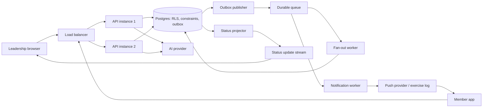

# CrewLink Member Callout - Design

## Part 0 - Requirements

### What I am building

CrewLink will let leadership create an approved announcement for active members of its own local, optionally limited to a work classification. Sending creates one durable recipient record per member, then tracks that member's delivery, read, acknowledgement, and (in the design) RSVP state. Leadership sees aggregate progress while members receive a durable inbox item when they next connect; a push notification is only an alert, not the source of truth.

### Assumptions

The audience is active members of one local; retired and suspended members are excluded. “Immediately” means the send request is accepted in under one second and fan-out continues asynchronously, while an offline member receives the inbox item when they reconnect. Acknowledgement is optional per announcement; RSVP is independent from acknowledgement. Done means every eligible member has one logical recipient record, never more than one, even after retries or restarts. Leadership authority is local-scoped; this slice has no cross-local administrator role.

### Concern

The question about outsiders seeing wireman-apprentice contact information may describe an existing cross-local privacy breach, not a future feature request. Because union membership is sensitive, I would verify this immediately in production, preserve relevant audit logs, and handle a confirmed exposure as a security incident before deploying unrelated changes. The original report also combines “never received” and “saw it too late”; durable inbox access addresses both, while push delivery alone addresses neither reliably.

### Questions for Denise

1. Should unacknowledged members receive reminders or is a live count sufficient? Assumed: count only in this slice, with data retained for later reminders.
2. Should retired or suspended members receive emergency callouts? Assumed: no; only active members are eligible.
3. Who may send local-wide announcements and is a second approver needed? Assumed: local leadership may send after reviewing its own AI draft; no additional approval workflow is required.

## Part A - Design

### 1. Data model

`locals(id, name)` is the tenant boundary. `members(id, local_id FK, full_name, email, classification, status)` keeps the supplied starter fields. `users(id, member_id nullable FK, local_id FK, email, password_hash, role)` holds authentication and authorization. Roles are `leadership` and `member`; a user has exactly one local in this slice.

`announcements(id, local_id FK, title, body, push_preview, audience_classification nullable, needs_ack, status, approved_by FK, approved_at, sent_at, created_at, client_idempotency_key)` stores the reviewed message and audience definition. `status` is `draft`, `approved`, `sending`, `sent`, or `cancelled`. A unique constraint on `(local_id, client_idempotency_key)` makes a repeated client submission return the same announcement rather than create another send.

`deliveries(id, local_id FK, announcement_id FK, member_id FK, state, rsvp nullable, created_at, delivered_at, read_at, acknowledged_at, responded_at)` is the central table. `state` progresses from `pending` to `delivered`, `read`, and `acknowledged`; `rsvp` is separately `coming`, `cannot_attend`, or null. A unique constraint on `(announcement_id, member_id)` makes one logical delivery row per intended person. `delivery_events(id, delivery_id FK, type, occurred_at, actor_user_id nullable, metadata)` preserves an audit trail of state changes and RSVP changes.

`outbox_events(id, type, aggregate_id, payload, created_at, published_at)` is written in the same transaction as an approved send. `notification_attempts(id, delivery_id FK, provider, status, attempted_at, provider_message_id nullable)` records simulated push activity in the slice. Index `deliveries(announcement_id, state)` supports status counts; index `deliveries(member_id, state)` supports an inbox.

### 2. Send path

At 14:02, leadership submits an already-approved draft with an idempotency key. The API authenticates the caller, derives its local and role from its token, validates that the requested local is the caller's local, and starts one database transaction. It changes the announcement to `sending`, records `sent_at`, and writes an `announcement.send` outbox event. It returns `202 Accepted` with the announcement ID immediately; it never iterates 22,400 members in the HTTP request.

An outbox publisher places that event on a durable queue. A fan-out worker reads active eligible members in deterministic batches (for example 500), inserts a `deliveries` row for each using `INSERT ... ON CONFLICT (announcement_id, member_id) DO NOTHING`, and enqueues a notification task for newly inserted rows. It can restart at any batch: existing rows are ignored and missing rows are inserted. Once the audience is exhausted, it marks the announcement `sent`.

Notification workers claim pending deliveries, write a notification-attempt record, and issue a push with the announcement/delivery ID as the client-side collapse/deduplication key. In the exercise, this is logged to the database. In production, a failed attempt retries with bounded exponential backoff; the member app also synchronizes its inbox from `deliveries`, so a member offline for days still finds the message when reconnecting. A provider cannot prove that a phone displayed one alert exactly once; the guaranteed unit is one durable, deduplicated inbox delivery and one receipt record.

The status screen receives server-sent events (or WebSocket updates) when delivery states change. A small status projector updates per-announcement counters after each batch/event; four open screens subscribe to the same updates instead of polling and repeatedly counting the full delivery table. The screen can fall back to a modestly cached aggregate endpoint.

### 3. The two rules, by design

**Rule 1 - isolation and role control.** The API never trusts a `local_id` or role from the browser. Authentication attaches a server-verified `actor(local_id, role, user_id)` to each request. Every service method accepts that actor and scopes reads and writes by `local_id`; leadership-only routes use one centralized permission class. Database row-level security is also enabled for tenant-owned tables, with the request transaction setting the authenticated local ID, so an accidentally unscoped query fails closed. Foreign-key and check constraints keep a delivery's member, announcement, and local consistent. Member endpoints additionally require `delivery.member_id` to match the authenticated member. New endpoints must use the tenant-scoped service/repository and the database policy; code review, integration tests using both locals, and a default-deny route policy make omission visible.

**Rule 2 - retry and restart safety.** The database, not button state or process memory, owns idempotency. The send idempotency key prevents duplicate announcements from a repeated request; the unique `(announcement_id, member_id)` constraint prevents duplicate recipients when jobs are redelivered or two backend instances run concurrently. The outbox avoids the opposite failure where the announcement commits but its queue job is lost. Workers are intentionally at-least-once; their inserts and notification-task creation are idempotent. The mobile inbox deduplicates by delivery ID, protecting the user even if a push provider repeats an alert.

**Detection.** Immutable audit events record actor, local, action, and target. Security monitoring alerts on policy denials, unexpected cross-local references, and privileged actions; scheduled integrity checks look for delivery/member/announcement local mismatches. Metrics and alerts track duplicate-key conflicts, fan-out completion, queue age, pending rows, notification failures, and any query reporting more than one delivery per announcement/member. Automated tests attempt cross-local reads and concurrent/retried sends against separate instances.

### 4. Diagram

## Scope cut and next steps

The build will log push notifications rather than use FCM/APNs, provide member read/ack APIs rather than a member UI, and omit RSVP implementation while retaining its schema. Production next steps are reminder policies, device-token lifecycle handling, rate limits, incident tooling, retention rules, backups, and independently tested multi-instance deployment.
